# UX Design Specification ronin

**Author:** V
**Date:** 2025-12-17

---

<!-- UX design content will be appended sequentially through collaborative workflow steps -->

## Executive Summary

### Project Vision

Ronin is the "HQ" (Markas Besar) for your project life - a lightweight desktop app that solves project abandonment through instant context recovery. Built on the philosophy of the masterless samurai: **autonomous yet disciplined, wandering yet purposeful**.

Unlike GitHub (code-only) or Notion (setup-heavy), Ronin passively observes your work and tells you exactly where you left off. The core promise: **Open any dormant project and feel confidence instead of dread. In 10 seconds, know exactly where you left off and what to do next.**

### Target Users

**V (Developer):** Has 15+ project folders, needs a place for the *thinking* around code. Wants to open a dormant project and feel confidence instead of dread. *"GitHub itu buat nyimpen code, bukan nyimpen 'isi otak' gue pas lagi coding."*

**Yosi (Non-developer):** Student managing document folders. Needs zero-setup simplicity - add folder, see status, done. *"Notion terlalu ribet, harus dihias-hias dulu baru enak dipake."*

**Fajar (Professional):** Juggling multiple workspaces. Exhausted by tool fragmentation. *"Gue cuma pengen tau hari ini harus ngapain, titik."*

### Key Design Challenges

- Serving developers (Git-aware) AND non-developers (folder-only) in one clean interface
- Making AI context recovery feel instant (<10s) and trustworthy
- Zero-friction onboarding - no setup, no decoration, no configuration
- Avoiding surveillance feel - behavior tracking that helps, not judges

### Design Opportunities

- The "map" metaphor - visual project health at a glance replaces folder anxiety
- Emotional transformation: dread → confidence when facing dormant projects
- "Works FOR you" principle - passive observation, proactive surfacing
- The Three Acts journey: Wanderer → Strategist → Master (tool becomes invisible)

### Design Philosophy (The Five Pillars)

| Pillar | UX Principle |
|--------|--------------|
| **義 (Gi)** | Behavior-first inference - your actions are the documentation |
| **勇 (Yu)** | AI suggests, never commands - courage through knowledge |
| **仁 (Jin)** | Compassionate language - "You were stuck" not "You were unproductive" |
| **礼 (Rei)** | Morning ritual - Open Ronin → See map → Start coding |
| **智 (Chi)** | Lightweight by design - <200MB, works on 8GB laptop |

### Key UX Decisions (from Party Mode)

**Ronin Oath Display:**
- ❌ Not during installation (friction)
- ✅ After first onboarding completes - full oath with visual treatment
- ✅ Permanent home in Settings → Philosophy/About
- ✅ Visual: ink brush style ronin illustration via Asset Pipeline
- 🎯 Purpose: "Reset button for the soul" when feeling overwhelmed

**Loading/Context Recovery UX:**
- Progressive disclosure: show local data instantly (<2s), stream AI context as it arrives
- Loading animation: ronin meditation → ready stance (via Asset Pipeline)
- MVP: simple pulsing ronin icon; full animation in v0.3
- Philosophy-aligned: the loading moment becomes ritual, not interruption

## Core User Experience

### Defining Experience

**Two Core Loops:**

| Loop | Frequency | Value | Description |
|------|-----------|-------|-------------|
| **Passive Loop** | High (5-10x/day) | Awareness | Open Ronin → Glance dashboard → Know what needs attention |
| **Active Loop** | Medium (2-3x/day) | Action | Click project → Get context → Code with confidence |

The dashboard glance is the **high-frequency** interaction. Context recovery is the **high-value** interaction. Both must be optimized.

### Platform Strategy

| Aspect | Decision |
|--------|----------|
| **Platform** | Desktop (Rust/Tauri) - Linux first, cross-platform later |
| **Input** | Mouse/keyboard primary |
| **Offline** | Dashboard, Git, DEVLOG work offline; AI requires internet |
| **System Integration** | System tray, global hotkey (Ctrl+Alt+R), desktop notifications |
| **Default View** | Dashboard with smart highlighting + 'Resume: [last project]' button |

### Effortless Interactions

| Interaction | Target | How |
|-------------|--------|-----|
| **Dashboard load** | <500ms | Local SQLite query only, no API calls |
| **Context recovery** | <10s total | Progressive: local data <500ms, AI thinking <2s, AI complete <10s |
| **Add project** | <30 seconds | Browse → Select folder → Done. No configuration. |
| **Morning check-in** | <5 seconds | Dashboard shows health at a glance, attention items highlighted |
| **One-click git** | Single button | Commit message → Commit → Push (with guardrails) |

### Critical Success Moments

1. **The "Aha!" Moment:** User opens dormant project → AI shows exactly where they left off → User feels confidence instead of dread
2. **The Map Moment:** First dashboard view → User sees all projects organized by health → "Finally, I can see everything"
3. **The Resurrection Moment:** Dormant project (>14 days) gets a commit within 24 hours of opening in Ronin

### Experience Principles

| Principle | Meaning |
|-----------|---------|
| **Behavior over documentation** | Infer context from actions, don't demand notes |
| **Progressive disclosure** | Show something instantly, enhance as data arrives |
| **Zero-config by default** | Works immediately, customization optional |
| **Suggest, never command** | AI offers help, user decides |
| **Ritual, not interruption** | Loading states feel like part of the experience |
| **Map before action** | Dashboard (awareness) is the home; deep-dive is secondary |

## Desired Emotional Response

### Primary Emotional Goals

| Emotion | When | Why |
|---------|------|-----|
| **Confidence** | Opening dormant project | "I know exactly where I left off" - the core transformation |
| **Relief** | Glancing at dashboard | "I can see everything, nothing is forgotten" |
| **Calm** | During context recovery | Loading feels like ritual, not waiting |
| **Empowerment** | After AI suggestion | "I decide what to do, AI just helps" |

**The Core Emotional Transformation:**
```
Before Ronin: Dread → Avoidance → Project death
With Ronin:   Curiosity → Confidence → Action
```

### Emotional Journey Mapping

| Stage | Current Emotion | Target Emotion | How |
|-------|-----------------|----------------|-----|
| **First launch** | Skeptical, curious | Intrigued, welcomed | Ronin Oath + clean onboarding |
| **Dashboard glance** | Overwhelmed (15 folders) | Calm, in control | Visual map, clear health indicators |
| **Click dormant project** | Dread, anxiety | Curiosity, hope | Ronin meditation animation |
| **AI context appears** | Waiting, impatient | "Aha!", confidence | Progressive disclosure, streaming |
| **Start coding** | Uncertain | Confident, ready | Clear next step from AI |
| **Error/offline** | Frustrated | Understood, patient | Graceful degradation, clear messaging |

### Micro-Emotions

| Positive (Cultivate) | Negative (Avoid) |
|---------------------|------------------|
| Confidence | Surveillance/being watched |
| Trust in AI | Judgment ("you were unproductive") |
| Accomplishment | Guilt about abandoned projects |
| Belonging (ronin identity) | Overwhelm from too much data |
| Calm focus | Anxiety from notifications |

### Error & Empty States (Emotional Design)

**Error States by Type:**

| State | Emotion | Visual | Message |
|-------|---------|--------|---------|
| **No internet** | Calm acceptance | Ronin meditating | "Offline mode. Local tools ready." |
| **API error** | Patient hope | Ronin sharpening blade | "AI reconnecting... Your dashboard is ready." |
| **Rate limit** | Gentle pause | Ronin resting | "AI resting. Try again in [X] seconds." |

**Empty State (First Launch):**
- ❌ Bad: Empty dashboard with "No projects yet" (lonely, cold)
- ✅ Good: Welcoming ronin illustration + "Your journey begins. Add your first project." (inviting, purposeful)

### Design Implications

| Emotion | UX Design Approach |
|---------|-------------------|
| **Confidence** | AI shows sources ("Based on: 15 edits, 3 searches") - transparency builds trust |
| **Calm** | Loading animation is meditative, not urgent; no spinning wheels |
| **Relief** | Dashboard uses warm colors (Antique Brass), not alarming reds |
| **Empowerment** | AI "suggests", never "you must"; user always in control |
| **Belonging** | Ronin philosophy accessible; Japanese aesthetic touches |

### Emotional Design Principles

| Principle | Implementation |
|-----------|----------------|
| **仁 (Jin) - Compassion** | "You were stuck" not "You were unproductive" |
| **No shame, only help** | Never show productivity scores or time tracking |
| **Ritual over interruption** | Loading states feel intentional, not broken |
| **Transparency builds trust** | AI always shows its reasoning sources |
| **Calm over urgent** | Muted notifications, no red badges screaming for attention |
| **Graceful degradation** | Error states reinforce philosophy: "Your local tools remain sharp" |

### Emotional Validation (MVP)

After first week of use, prompt: "How do you feel when opening a dormant project?"

Emoji scale: 😰 → 😐 → 😊 → 🔥

Target: Shift from 😰 (dread) to 😊/🔥 (confidence/excitement)

## UX Pattern Analysis & Inspiration

### Inspiring Products Analysis

**Claude.ai / Claude Code**

| Pattern | Implementation | Ronin Application |
|---------|----------------|-------------------|
| **Lightweight feel** | Fast load, minimal chrome | Dashboard <500ms, content-first layout |
| **Clean modern design** | Whitespace, muted colors | Cararra (#F0EFEA) backgrounds, Friar Gray (#828179) borders |
| **Thinking transparency** | Shows reasoning process | AI shows sources: "Based on: 15 edits to auth.rs" |
| **Clear onboarding** | Guided, not overwhelming | First launch: simple folder add, then Ronin Oath |
| **Interactive feature intro** | Teaches while doing | Contextual tooltips for new features, not modal dumps |

**Notion (Anti-pattern source)**

| What to Avoid | Why | Ronin Alternative |
|---------------|-----|-------------------|
| Setup complexity | "Harus dihias-hias dulu" | Zero-config: add folder → done |
| Template overwhelm | Too many choices paralyze | One default view, customization optional |
| Heavy/slow | Electron bloat | Tauri <200MB |

**GitHub Desktop (Partial inspiration)**

| What Works | What's Missing | Ronin Fills Gap |
|------------|----------------|-----------------|
| Clean git visualization | No project context | DEVLOG + AI context |
| Simple commit flow | Code-only focus | "Brain state" storage |
| Repository list | No health indicators | Active/Dormant/Stuck status |

**Linear (Developer UX inspiration)**

| Pattern | Why It Works | Ronin Application |
|---------|--------------|-------------------|
| Keyboard-first | Developers love shortcuts | Global hotkey + Cmd+K palette (v0.3) |
| Minimal clicks | Fast task completion | One-click commit, expandable cards |
| Information-dense but clean | Respects user intelligence | Dashboard shows health at glance |

### Transferable UX Patterns

**From Claude:**
- Streaming AI responses (chunked, not word-by-word)
- Thinking/reasoning visible to user
- Clean typography with generous whitespace
- Contextual feature introduction

**From GitHub Desktop:**
- Simple commit message → commit → push flow
- Repository list as primary navigation
- Branch indicator always visible

**From Linear:**
- Keyboard-first navigation
- Command palette for power users (v0.3)
- Design actions with names for future discoverability

### AI Context Display Pattern

**Decision: Expandable Card**

| State | What's Visible |
|-------|----------------|
| **Collapsed** | Project card with health indicator, last activity |
| **Expanded** | AI context summary + "Based on:" attribution |
| **Deep dive** | Click attribution to see full sources (commits, searches) |

**Chunked Streaming Sequence:**
1. **0ms:** Card expands, ronin meditation animation
2. **200ms:** Local data (git status, last modified)
3. **500ms:** "Analyzing your activity..." pulse
4. **1-2s:** AI chunks stream progressively
5. **Complete:** Ronin ready stance, full context visible

### Anti-Patterns to Avoid

| Anti-Pattern | Source | Why Avoid |
|--------------|--------|-----------|
| **Setup wizard overload** | Notion | Kills first-time momentum |
| **Productivity scores** | WakaTime | Creates judgment, not help |
| **Dense information** | Jira | Overwhelms, doesn't orient |
| **Modal interruptions** | Many apps | Breaks flow, feels intrusive |
| **Slow/heavy feel** | Electron apps | Frustrates daily ritual |
| **Word-by-word streaming** | Some AI apps | Feels slow for short summaries |

### Design Inspiration Strategy

**Adopt:**
- Claude's transparency (show AI reasoning)
- Claude's clean, modern aesthetic
- Linear's keyboard-first philosophy
- GitHub Desktop's simple git flow

**Adapt:**
- Claude's streaming → Chunked reveal for summaries
- Claude's chat → Expandable card context panel
- Linear's Cmd+K → v0.3 feature, design for it now

**Avoid:**
- Notion's setup complexity
- WakaTime's productivity judgment
- Heavy Electron feel
- Instant AI response (feels "too easy", no perceived work)

## Design System Foundation

### Design System Choice

**Primary:** shadcn/ui + Tailwind CSS
**Style:** Clean functional UI + Science SARU-inspired illustrations
**Platform:** Tauri v2 (React frontend)

### Rationale for Selection

| Factor | Why shadcn/ui + Tailwind |
|--------|-------------------------|
| **Speed** | Pre-built accessible components, copy-paste into project |
| **Customization** | Full control - components live in your codebase |
| **Tauri compatibility** | React-based, works perfectly with Tauri v2 |
| **Claude-like aesthetic** | Clean, modern, whitespace-rich - matches inspiration |
| **Lightweight** | No heavy runtime, just CSS + components |
| **Developer experience** | V is the developer - familiar stack |

### Theme Modes

| Mode | Background | Text | Accent |
|------|------------|------|--------|
| **Light** | Cararra (#F0EFEA) | Cod Gray (#141413) | Antique Brass (#CC785C) |
| **Dark** | Cod Gray (#141413) | Cararra (#F0EFEA) | Antique Brass (#CC785C) |

User-selectable theme. Antique Brass accent works in both modes.

### Brand Token Integration

```css
/* Ronin Brand Tokens - Light Mode */
--ronin-primary: #CC785C;      /* Antique Brass - CTAs, active states */
--ronin-secondary: #828179;    /* Friar Gray - borders, muted text */
--ronin-background: #F0EFEA;   /* Cararra - main background */
--ronin-surface: #FFFFFF;      /* White - cards, elevated surfaces */
--ronin-text: #141413;         /* Cod Gray - primary text */

/* Ronin Brand Tokens - Dark Mode */
--ronin-background-dark: #141413;
--ronin-surface-dark: #1a1a19;
--ronin-text-dark: #F0EFEA;
```

### Asset Strategy

| Asset Type | Format | Location | Use Case |
|------------|--------|----------|----------|
| **UI Components** | TSX (shadcn/ui) | `src/components/` | Buttons, cards, inputs |
| **Icons** | SVG | `public/icons/` | Simple status icons, navigation |
| **Illustrations** | PNG (WebP optimized) | `public/assets/` | Ronin character, empty states, error states |
| **Loading animation** | Lottie/GIF | `public/assets/` | Meditation → ready sequence |

**Illustration approach:**
- Style: Science SARU-inspired (expressive, hand-drawn, emotional)
- Format: PNG with transparent background (works in both light/dark modes)
- NOT converted to TSX - too complex for vector conversion
- Generated via Asset Pipeline (Imagen) → optimized PNG

### Implementation Approach

| Phase | Components |
|-------|------------|
| **MVP v0.1** | Card, Button, Input, Badge (status indicators) |
| **MVP v0.2** | Dialog, Dropdown, Textarea (DEVLOG editor), Toast |
| **MVP v0.3** | Command palette (Cmd+K), Tooltip, Skeleton loaders, Key illustrations |

### Custom Components Needed

| Component | Purpose |
|-----------|---------|
| **ProjectCard** | Expandable card with AI context panel |
| **HealthIndicator** | Status badges (Active 🔥 / Dormant 😴 / Stuck ⚠️) |
| **ContextPanel** | AI summary with "Based on:" attribution |
| **RoninLoader** | Meditation → ready animation (respects `prefers-reduced-motion`) |

### Accessibility Requirements

| Requirement | Implementation |
|-------------|----------------|
| **Color contrast** | WCAG AA (≥4.5:1) - not color-only indicators |
| **Keyboard navigation** | All actions accessible via keyboard |
| **Screen reader** | ARIA labels on custom components |
| **Reduced motion** | `prefers-reduced-motion` support - static fallbacks |
| **Focus management** | Proper focus when AI content streams in |

## Defining Experience

### The Core Interaction

**One-liner users will tell friends:**
> "I open any project I abandoned weeks ago, and in 10 seconds I know exactly what I was doing and what to do next."

**The emotional transformation:**
```
Before: "Ugh, I don't remember anything about this project" (dread)
After:  "Oh right, I was stuck on that! Let me try this..." (confidence)
```

### User Mental Model

**Current solutions and their failures:**

| Solution | What Users Do | Why It Fails |
|----------|---------------|--------------|
| **Git log** | `git log --oneline` | Shows WHAT changed, not WHY or WHAT'S NEXT |
| **README/Notes** | Read old documentation | Often outdated, doesn't capture "brain state" |
| **Memory** | Try to remember | Decays after 2+ weeks |
| **Re-read code** | Scroll through files | Takes 30+ minutes, frustrating |

**Mental model Ronin creates:**
> "My projects have memory. Even if I forget, Ronin remembers."

### Success Criteria

| Criteria | Target | Measurement |
|----------|--------|-------------|
| **Time to context** | <10 seconds | Click project → AI response complete |
| **Accuracy** | 80% without DEVLOG, 90% with | User confirms "yes, that's right" |
| **Emotional shift** | Dread → Confidence | Self-reported emoji scale |
| **Action taken** | Commit within 24h | "Resurrection rate" metric |

### Novel UX Patterns

**Established patterns we use:**
- Dashboard with cards (familiar from Notion, Trello)
- Expandable cards (familiar from many apps)
- Git status display (familiar from GitHub Desktop)

**Novel pattern: Behavioral Inference with Visible Reasoning**
- AI infers context from ACTIONS, not notes
- **Reasoning is ALWAYS visible** - not collapsed, not hidden
- This is differentiation: WakaTime shows stats, Ronin shows reasoning
- Inspired by Claude's thinking transparency - "one of the reasons to switch"

**Attribution Display:**
- Visual icons hint at data sources (git icon, search icon, file icon)
- Click expands full source detail
- Always visible by default - it's a feature, not fine print

### Experience Mechanics

**1. Initiation:**
- User opens Ronin (morning ritual)
- Dashboard shows all projects with health indicators
- Dormant project has visual cue (😴 badge, muted color)

**2. Interaction:**
- User clicks dormant project card
- Card expands (animation: ronin meditation begins)
- Local data appears instantly (<500ms): branch, uncommitted files, last modified

**3. Feedback:**
- "Analyzing your activity..." pulse (500ms-2s)
- AI context streams in chunks:
  - "Last session: Nov 23"
  - "You were editing auth.rs"
  - "Stuck on lifetime issue"
  - "Suggestion: try Arc<Mutex<>>"
- Attribution visible: 🔀 15 edits · 🔍 3 searches · 📝 DEVLOG
- Animation: ronin shifts to ready stance

**4. Completion:**
- Full context visible with expandable "Based on:" attribution
- User feels: "Oh right! I remember now."
- Clear next action: "Open in VS Code" button

**5. Editor Launch:**
- Shell command approach: `code /path/to/project` (configurable)
- Settings: choose preferred editor (VS Code, Zed, Neovim, etc.)
- Error handling: "VS Code not found. Configure your editor in Settings."

### Failure States

| Failure Point | User Sees | Recovery |
|---------------|-----------|----------|
| **AI timeout** | "Taking longer than usual..." | Show local data, offer retry |
| **AI error** | "Couldn't analyze this time" | Show local data, manual DEVLOG link |
| **Partial response** | Whatever streamed so far | Mark as incomplete, offer retry |
| **No internet** | "Offline mode" | Local data only, AI unavailable message |

**Key principle:** Never leave user with nothing. Local data is always the fallback.

### First-Time Experience

When user clicks a project with no behavioral data yet:
1. Show git-based context (commits, branches, last modified)
2. Display tip: "Add notes to DEVLOG for richer context next time"
3. Silent Observer starts learning from this moment

## Visual Design Foundation

### Color System

**Brand Palette (from ronin-brand-colors.md):**

| Name | Hex | Role |
|------|-----|------|
| **Antique Brass** | #CC785C | Primary accent - CTAs, active states, links |
| **Friar Gray** | #828179 | Secondary - borders, muted text, icons |
| **Cararra** | #F0EFEA | Light mode background |
| **White** | #FFFFFF | Cards, elevated surfaces |
| **Cod Gray** | #141413 | Dark mode background, light mode text |

**Theme Modes (User-selectable):**

| Semantic | Light Mode | Dark Mode |
|----------|------------|-----------|
| `--background` | #F0EFEA | #141413 |
| `--surface` | #FFFFFF | #1a1a19 |
| `--text-primary` | #141413 | #F0EFEA |
| `--text-secondary` | #828179 | #a0a099 |
| `--accent` | #CC785C | #CC785C |
| `--border` | #e0dfda | #2a2a28 |

**Status Colors (with icons - not color-only):**

| Status | Color | Icon | Meaning |
|--------|-------|------|---------|
| **Active** | Green tint | 🔥 | Recent activity |
| **Dormant** | Muted/gray | 😴 | >14 days inactive |
| **Stuck** | Amber tint | ⚠️ | Detected stuck pattern |
| **Needs Attention** | Antique Brass | 📌 | Uncommitted changes |

### Typography System

**Font Families:**

| Font | Source | Role |
|------|--------|------|
| **Libre Baskerville** | Google Fonts | Serif - CTAs, special moments, Oath phrases |
| **Work Sans** | Google Fonts | Sans - UI text, headings, body copy |
| **JetBrains Mono** | Google Fonts | Mono - code, paths, git info, AI context |

**Font Files:** `public/fonts/` (offline-first, bundled in app)
- Work Sans: Regular (400), Medium (500), SemiBold (600), Bold (700)
- JetBrains Mono: Regular (400), Medium (500)
- Libre Baskerville: Regular (400), Italic (400i), Bold (700)

**Format:** `.woff2` only (modern, smallest size, universal support)

**Font Loading Strategy:**
- ALL fonts preload during 1-second loading screen
- Loading screen shows ronin meditation animation
- No font-display swap needed - fonts ready before UI renders
- Total bundle: ~300KB (acceptable for desktop app)

**Typography Hierarchy (by meaning):**

| Category | Font | Purpose |
|----------|------|---------|
| **Functional** | Work Sans | Do things (UI, navigation, labels) |
| **Technical** | JetBrains Mono | Understand things (code, git, AI context) |
| **Philosophical** | Libre Baskerville | Feel things (CTAs, Oath, special moments) |

**Serif for CTAs:** Libre Baskerville on buttons creates intentional contrast - draws the eye, feels deliberate.

**Ronin Oath Typography Process:**
1. Write full Oath in Work Sans
2. V reviews, marks phrases that feel 'special'
3. Special phrases get Libre Baskerville
4. Iterate until it *feels* right (emotional design)

**Type Scale:**

| Level | Font | Size | Weight |
|-------|------|------|--------|
| **h1** | Work Sans | 2.25rem | 600 |
| **h2** | Work Sans | 1.5rem | 600 |
| **h3** | Work Sans | 1.25rem | 500 |
| **body** | Work Sans | 1rem | 400 |
| **small** | Work Sans | 0.875rem | 400 |
| **cta** | Libre Baskerville | 1rem | 400 |
| **code** | JetBrains Mono | 0.875rem | 400 |

### Spacing & Layout Foundation

**Base Unit:** 4px (Tailwind default)

**Spacing Scale:**
- `xs`: 4px - tight spacing
- `sm`: 8px - compact elements
- `md`: 16px - default spacing
- `lg`: 24px - comfortable breathing room
- `xl`: 32px - section separation
- `2xl`: 48px - major section gaps

**Layout Principles:**
1. **Content-first:** Generous whitespace, cards breathe
2. **Dashboard density:** Balanced - information-rich but not cramped
3. **Claude-inspired:** Clean, modern, whitespace-rich

**Grid System:**
- Dashboard: Responsive card grid (1-3 columns based on viewport)
- Project detail: Single column with context sidebar

### Accessibility Considerations

| Requirement | Implementation |
|-------------|----------------|
| **Color contrast** | WCAG AA (≥4.5:1 for text) |
| **Not color-only** | Status uses icons + color |
| **Focus visible** | Clear focus rings (Antique Brass) |
| **Reduced motion** | Respect `prefers-reduced-motion` |
| **Font sizing** | Minimum 14px, scalable |
| **Keyboard nav** | All interactive elements focusable |

## Design Direction Decision

### Design Directions Explored

Four directions created and visualized in `docs/ux-design-directions.html`:

1. **Clean Minimal** - Claude-inspired, whitespace-rich, card grid
2. **Dense Dashboard** - Linear-inspired, table view, power-user focused
3. **Sidebar Navigation** - VS Code-inspired, persistent project list
4. **Expanded Card Focus** - Card expands in-place, no page navigation

### Chosen Direction

**Direction 1: Clean Minimal** ✅

| Aspect | Decision |
|--------|----------|
| **Layout** | Card grid, responsive (1-3 columns) |
| **Density** | Whitespace-rich, cards breathe |
| **Card behavior** | Expandable in-place with AI context |
| **Primary action** | "Open in IDE" button inside expanded card |
| **Navigation** | Search bar (Ctrl+K ready for v0.3 command palette) |

### Typography in Direction

| Element | Font | Rationale |
|---------|------|-----------|
| **Logo (浪人 Ronin)** | Libre Baskerville | Brand identity, elegant with Japanese characters |
| **Section headings** | Libre Baskerville | Creates hierarchy of meaning |
| **Project names** | Libre Baskerville | Each project feels important |
| **CTAs** | Libre Baskerville | Intentional, draws the eye |
| **Body/UI text** | Work Sans | Functional, readable |
| **Code/technical** | JetBrains Mono | Developer-familiar |

### Icon Strategy

| Phase | Approach | Style |
|-------|----------|-------|
| **MVP v0.1-v0.2** | System emoji (🔥😴⚠️📌) | Ships fast, placeholder |
| **MVP v0.3** | Custom SVG icons | Science SARU-inspired, hand-drawn feel |

**Custom icon concepts for v0.3:**
- Active → Flame with brush stroke texture
- Dormant → Closed eye or moon, ink style
- Stuck → Tangled line or knot
- Needs Attention → Subtle pulse/glow

### Design Rationale

1. **Claude-inspired clarity** - Maximum whitespace matches the "thinking transparency" inspiration
2. **Card expansion** - Context appears inline, no page navigation, supports the <10s context recovery goal
3. **Serif elegance** - Libre Baskerville elevates the UI from "just another dashboard" to something intentional
4. **Progressive disclosure** - Collapsed cards show status, expanded cards show full AI context
5. **Morning ritual feel** - Clean, calm, not overwhelming - supports the 礼 (Rei) principle

### Implementation Notes

- HTML mockup available: `docs/ux-design-directions.html`
- Dark/light mode toggle functional in mockup
- All brand colors applied and tested
- Typography hierarchy visible and validated

## User Journey Flows

### Journey 1: Context Recovery (V's Core Flow)

**The defining experience - "Where was I?"**


**Key moments:**
- Dashboard → Card click: <1 second
- Card expand → First content: <500ms
- Full AI context: <10 seconds
- Emotional shift: Dread → Confidence

**Cold-start handling:** Projects without behavioral data show git-only context + tip to add DEVLOG for richer context next time.

---

### Journey 2: First-Time Onboarding (Yosi's Flow)

**Zero-friction setup - "Add folder, see status, done"**


**Key moments:**
- Install → Dashboard: <30 seconds
- Add folder: 3 clicks max
- No configuration required
- Oath appears AFTER first value delivered (celebration, not blocker)

---

### Journey 3: Morning Ritual (Daily Check-in)

**The passive loop - "What needs attention today?"**

```mermaid
flowchart TD
    A[Morning: Open Ronin] --> B[Dashboard loads <500ms]
    B --> C{Recent session exists?}
    C -->|Yes| D[Show 'Resume: chippy' button]
    C -->|No| E[Show full dashboard]
    D --> F{User choice}
    F -->|Resume| G[Direct to last project context]
    F -->|Browse| E
    E --> H[Glance at project cards]
    H --> I{Any ⚠️ or 😴?}
    I -->|Yes| J[See which projects need attention]
    I -->|No| K[All good, pick project or close]
    J --> L{Decide action}
    L -->|Work on it| M[Click card → Context Recovery]
    L -->|Later| N[Mental note, continue day]
    L -->|Archive| O[Archive project]
```



**Key moments:**
- Open → Oriented: <5 seconds
- Resume button shortcuts to last session
- No clicking required to understand state
- Dashboard IS the value (passive loop)

---

### Journey 4: One-Click Commit (Quick Git)

**Frictionless git - "Commit without terminal"**


**Key moments:**
- See uncommitted → Commit done: <30 seconds
- Commit and Push are SEPARATE buttons (safer)
- Guardrails prevent mistakes
- No terminal needed for simple operations

---

### Journey Patterns

| Pattern | Usage | Implementation |
|---------|-------|----------------|
| **Progressive disclosure** | All journeys | Show summary first, details on demand |
| **Instant local, streaming AI** | Context recovery | Local data <500ms, AI streams after |
| **Card as container** | Dashboard | All actions happen within expanded card |
| **Graceful degradation** | Error states | Always show local data, AI is enhancement |
| **Confirmation for destructive** | Git push, archive | Warn before irreversible actions |
| **Resume shortcut** | Morning ritual | One-click return to last session |

### Flow Optimization Principles

1. **Minimize clicks to value** - Dashboard visible immediately, one click to context
2. **Show don't tell** - Health indicators visible without interaction
3. **Progressive feedback** - Each step confirms progress (animations, state changes)
4. **Error recovery built-in** - Every error state has a clear next action
5. **Ritual-friendly** - Flows support daily habits, not one-time tasks
6. **Separate concerns** - Commit ≠ Push, each action is explicit

### Journey Test Metrics

| Journey | Key Metric | Target |
|---------|------------|--------|
| **Context Recovery** | Time to AI complete | <10s |
| **Onboarding** | Time to first project visible | <30s |
| **Morning Ritual** | Time to oriented | <5s |
| **One-Click Commit** | Clicks to commit | ≤3 |
